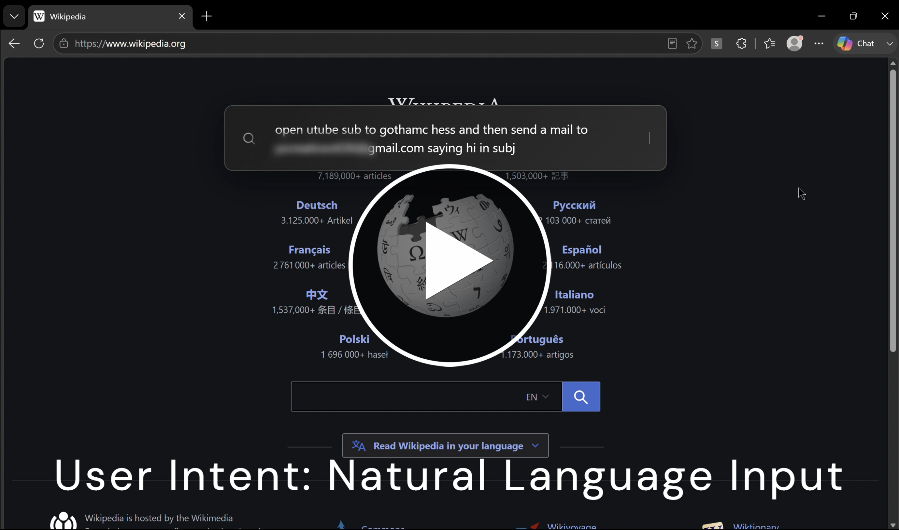

# Autonomous AI Browser Agent


A Chrome extension that turns your browser into an AI-powered automation assistant. Type what you want in the search bar (e.g. *"open Canvas and search for PHY131"*), and it navigates, clicks, and types for you.
---

## 🎥 Demo
[](https://youtu.be/j1oFcvMeUs8?si=K1htWWdhESmr0jsO)

---

## Features

- **Search-bar style commands** — Hold **P** to open the HUD, type your request, press Enter
- **AI-driven execution plans** — Google Gemini converts natural language into steps (GOTO, CLICK, TYPE, etc.)
- **Auto-recovery** — On failures, the extension captures a screenshot and asks the AI to retry with a new plan (up to 3 retries per step)
- **THINK_AND_REQUERY** — For complex tasks, the AI can pause, analyze the page visually, and continue with a smarter plan
- **Smart interactions** — Finds buttons/links by text, fills forms, auto-submits search boxes
- **HUD UI** — Minimal overlay with search icon, blinking cursor, and choice/text prompts when the AI needs input
- **Settings page** — Options UI for storing your Gemini API key securely in Chrome sync storage
- **Plan persistence** — Survives page reloads (e.g. after GOTO) and resumes execution

## Tech Stack

| Layer | Tech |
|-------|------|
| Extension platform | Chrome Manifest V3 |
| AI | Google Gemini API (gemini-2.5-flash) |
| Storage | chrome.storage.local (plans, variables), chrome.storage.sync (API key) |
| UI | Vanilla JS, inline CSS, HUD overlay |
| Permissions | storage, history, tabCapture, \<all_urls\> |

## Installation

1. Clone or download this repo
2. Open `chrome://extensions/` → Enable **Developer mode** → **Load unpacked**
3. Select the project folder (the one containing `manifest.json`)
4. Right-click the extension icon → **Options** → paste your [Gemini API key](https://aistudio.google.com/app/apikey)

## Usage

1. Go to any webpage
2. **Hold P** for ~350ms until the HUD appears at the top
3. Type your request (e.g. *"search YouTube for piano tutorials"*, *"open Gmail"*, *"what is the capital of India"*)
4. Press **Enter**
5. The extension executes the plan and shows the result in the HUD

Press **Escape** anytime to close the HUD.

## Project Structure

```
├── manifest.json          # Extension config
├── settings.html          # Options page (API key)
├── assets/
│   └── style.css          # HUD styles
└── content/
    ├── background.js      # Service worker: AI calls, screenshots
    ├── ui.js              # HUD DOM + show/hide
    ├── main.js            # P-key activation, input capture, message to background
    └── actions.js         # Plan executor (GOTO, CLICK, TYPE, etc.)
```

## Available AI Actions

- `GOTO` — Navigate to URL  
- `CLICK` — Click element by text  
- `TYPE` — Fill input, supports `value_from` (from ASK_USER_INPUT)  
- `WAIT` — Delay in seconds  
- `ASK_USER` — Multiple choice prompt  
- `ASK_USER_INPUT` — Text input prompt  
- `EXTRACT` — Pull data from page  
- `THINK_AND_REQUERY` — Pause, screenshot, get new plan from AI  
- `FINAL_ANSWER` — Show result and end  

## License

MIT
